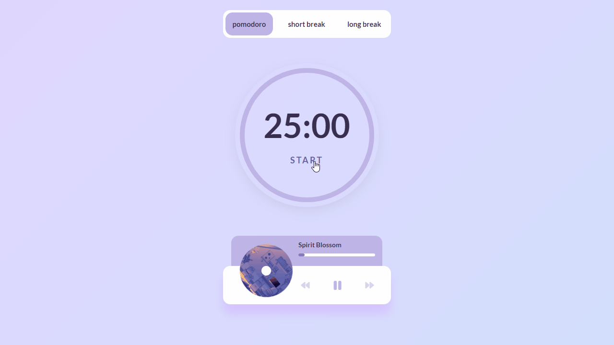

# LoFi Pomodoro 🎵

Pomodoro timer with a LoFi music player created with HTML, CSS/SASS, and JavaScript.

This application implements the pomodoro technique and tells the user exactly when to work and when to take a break. You have 25-minute focus sessions followed by five-minute breaks and a longer 15-minute break after four consecutive focus sessions.

The pomodoro process:

- Start a 25-minute timer (pomodoro mode)
- Work until the timer rings
- Take a break for 5 minutes (short break mode)
- Every four pomodoros, take a longer break (15 minutes)

The user is able to use the music player to play lofi songs during the pomodoro sessions and breaks.

This project was a great way to learn more about the HTML5 Audio API and to practice JavaScript topics like DOM manipulation, event listeners, and timer functions (`setTimeout`, `setInterval`).

  

## 🔗 Link

- [Live Demo](https://julianachagas.github.io/lofi-pomodoro)

## 🛠️ Technologies

- HTML
- CSS
- SASS
- JavaScript

## 💡 Features

Pomodoro

- User is able to set the timer to pomodoro mode, short break, or long break.
  - Pomodoro: 25 minutes
  - Short break: 5 minutes
  - Long break: 15 minutes
- User can stop and start the timer
- Audio notification at the end of a timer period
- Circular progress bar that updates every second and represents how far through their timer the user is
- The app will automatically start a short break session at the end of a pomodoro session and vice versa. After four pomodoro sessions, the app will switch to the long break mode. Once the break is finished, it'll go back to the pomodoro mode and start a new session.
- The countdown timer is displayed in the page title. This allows the user to quickly see how many minutes are left in a session without switching tabs.

Music Player

- Display song's title, progress bar, and cover image
- Play and pause songs
- Switch songs (next/previous)
- The user is able to click anywhere on the song's progress bar and go to that point in the song

## 💻 Demo

- Pomodoro Session: start/stop the timer

   

- The app automatically switches to the short break mode at the end of a pomodoro session

  

- Music Player: the user is able to play and pause a song, switch songs, and click on the progress bar

https://user-images.githubusercontent.com/76137636/204950512-1e1540cf-9766-4cba-b38d-0d3a075ca916.mp4

## 📚 Useful resources

- The royalty free music used in this project was collected from [Pixabay](https://pixabay.com/)

- [Brad Traversy](https://www.youtube.com/watch?v=QTHRWGn_sJw&ab_channel=TraversyMedia): Music player | Vanilla JavaScript

## 👩🏻‍💻 Author

---

##### Made with 💜 by Juliana Chagas
